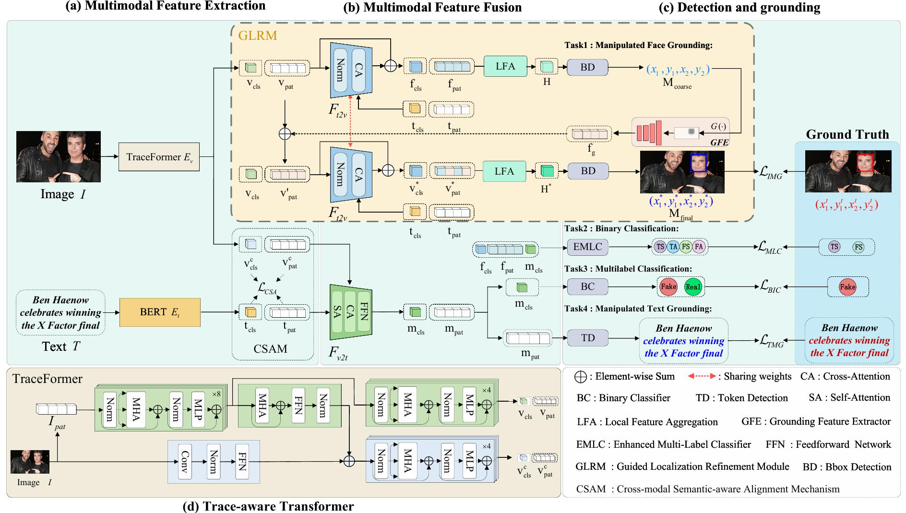

# Coarse-Aware Localization Refinement and Semantic Alignment for Multimodal Manipulation Detection

---

## 📖 Paper Overview

**CALSA** is a unified framework for **Detecting and Grounding Multi-modal Media Manipulations (DGM⁴)**. Our method addresses the challenging task of multimodal deepfake detection by jointly enhancing detection accuracy and localization precision across visual and textual modalities.

### 🔍 Key Highlights

- **Guided Localization Refinement Module (GLRM):**  
 Enhances tampering region prediction by refining coarse localization cues without requiring multi-stage processing, improving spatial precision for pixel-level manipulation detection.

- **Trace-aware Transformer (TraceFormer):**  
 A hybrid architecture that integrates multi-scale convolutional branches with Transformer-based global modeling, facilitating robust cross-modal feature fusion and comprehensive visual-textual understanding.

- **Cross-Modal Semantic-Aware Alignment Mechanism (CSAM):**  
 Introduces contrastive learning with dynamic boundary constraints and hard negative mining to promote semantic consistency between image and text modalities, significantly improving detection performance.


<p align="center">
 
</p>

---


## 🚀 Getting Started

### Prerequisites

- Python 3.8+
- PyTorch 1.12+
- CUDA 11.6+
---

### Installation

 Clone the repository:
 ```
 git clone https://github.com/your-username/CALS.git
 cd CALS
```
---
## 🛠️Prerequisites
- Python 3.8 or above
- Pytorch 1.12
- CUDA 11.6 or above


### Set Up the Environment
We recommend using Anaconda to manage the python environment:
```
conda create -n CALSA python=3.8
conda activate CALSA
conda install --yes -c pytorch pytorch=1.10.0 torchvision==0.11.1 cudatoolkit=11.3
pip install -r requirements.txt
conda install -c conda-forge ruamel_yaml
```


## Inference
1. Download the model checkpoint.<br>
   🤗 Hugging Face: [Checkpoint](https://huggingface.co/zj-1/checkpoint/resolve/main/checkpoint.pth)
2. Modify test.sh to set your desired configuration.
3. Run inference:
```
sh test.sh
```

### 🙏 Acknowledgements
We sincerely thank the authors of [MultiModal-DeepFake](https://github.com/rshaojimmy/MultiModal-DeepFake) for their excellent work.  
We heavily used the code from their repository in developing this project.

